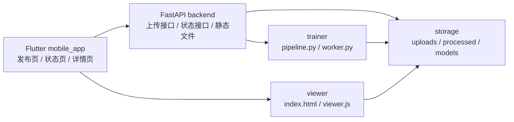
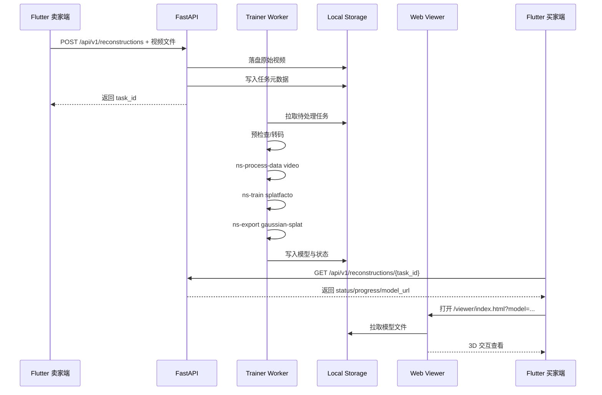

# 3DGS 二手交易平台本地 MVP 开发方案

## 1. 文档定位

本文档用于指导项目第一阶段的本地 MVP 开发，目标是在 Windows 单机环境下打通以下完整闭环：

`Flutter 采集入口 -> FastAPI 接收任务 -> 3DGS 训练链 -> Web Viewer -> Flutter WebView 查看`

本文档只覆盖当前最关键的 3DGS 工作链，不展开完整二手交易业务。

### 1.1 当前阶段目标

- 做出一个可运行的 Android 端入口页，支持选择或上传商品视频。
- 服务端接收视频并创建重建任务。
- 训练链完成视频预处理、相机位姿恢复、3DGS 训练、模型导出。
- 买家端可在商品详情页中通过 WebView 360° 查看商品 3D 模型。

### 1.2 当前阶段不做

- 不实现登录、订单、聊天、支付、推荐等完整电商业务。
- 不引入对象存储、消息队列、分布式调度、多机部署。
- 不优先打磨 UI 视觉设计。
- 不把 `SOG` 作为一期交付门槛。

### 1.3 一期关键决策

- 输入策略：视频优先。
- 平台定位：Android 首发，Flutter 作为唯一移动端框架。
- 模型产物：先以 `PLY` 跑通训练和导出。
- 查看器策略：先保证移动端可查看，`SOG` 压缩与纯 PlayCanvas Engine 化放入二期。
- 存储策略：本地磁盘为主，数据库不是当前闭环的前置依赖。

## 2. MVP 边界与总体架构

### 2.1 MVP 范围

MVP 只做三类能力：

1. 上传重建任务
2. 查询任务状态
3. 查看模型结果

换句话说，一期不是“二手平台完整产品”，而是“3D 商品录入与查看能力原型”。

### 2.2 系统架构图



### 2.3 端到端时序图



## 3. 技术路线与核心决策

### 3.1 标准技术链

本地 MVP 采用以下标准链路：

1. Flutter 采集或选择商品环绕视频
2. FastAPI 接收视频并创建任务
3. 服务端执行预检查与必要转码
4. 使用 `ns-process-data video` 处理视频数据
5. 使用 `ns-train splatfacto` 训练 3DGS
6. 使用 `ns-export gaussian-splat` 导出 `PLY`
7. 通过 `/viewer/index.html?model=...` 在移动端 WebView 中查看

### 3.2 为什么一期采用 `ns-process-data`

相比手写 `FFmpeg -> COLMAP` 命令串，`nerfstudio` 官方已经提供了 `ns-process-data {images, video}` 作为自定义数据入口。对当前 MVP 来说，这有三个好处：

- 前处理入口统一，后续切换图片输入也不需要重构训练接口。
- `COLMAP` 和 `FFmpeg` 的调用由工具链封装，减少人为拼命令出错。
- 与后续 `splatfacto` 训练流程天然对齐。

### 3.3 模型格式策略

一期默认导出 `PLY`，因为 `nerfstudio` 的 `ns-export gaussian-splat` 可以直接导出高斯点数据。

需要明确一个工程事实：

- `nerfstudio` 官方导出链路天然产出 `PLY`
- PlayCanvas Engine API 官方教程示例加载的是 `.sog`

因此一期的格式策略应为：

- 对外统一返回 `model_url`
- 一期先保证查看器能消费 `PLY`
- 二期在 `export` 阶段增加 `PLY -> SOG` 转换，不改变前后端接口契约

这意味着查看器层必须保留“格式适配”能力，而不是把模型文件格式写死在 App 层。

## 4. 采集规范与输入约束

### 4.1 平台接收规则

- 视频时长上限：`<= 60s`
- 推荐拍摄时长：`20~40s`
- 推荐内容：单个商品，环绕拍摄，物体尽量居中
- 推荐环境：背景干净、光照稳定、避免强反光和大面积遮挡

### 4.2 卖家侧拍摄建议

- 以平稳、匀速方式环绕物体一周或一周半。
- 保持物体始终出现在画面主要区域。
- 避免快速抖动、突然拉近、频繁自动曝光变化。
- 优先拍静态商品，不拍软体、透明体、强镜面反射体作为首批测试对象。

### 4.3 服务端预处理策略

即使视频时长合格，也不意味着原始规格适合直接进入训练。服务端应统一做以下预处理：

1. 检查时长、分辨率、编码格式
2. 必要时转码为训练友好的中间格式
3. 必要时降分辨率
4. 必要时限制抽样帧数

推荐原则：

- 先保证 COLMAP 和训练稳定性，再追求极限画质
- 一期优先可训练、可查看，而不是追求单次最优质量

### 4.4 当前测试素材结论

当前测试文件：`D:\video\3dgs_4k_60fps_400iso.mp4`

已确认信息：

- 时长约 `43.59s`
- 分辨率 `3840x2160`
- 编码 `HEVC`
- 文件大小约 `132.8 MB`
- 帧率约 `60fps`

结论：

- 时长符合平台 `<= 60s` 规则
- 但 4K / 60fps 对本地 MVP 来说偏重
- 实际训练前应先降采样或限制输入帧数量，再进入 `ns-process-data`

## 5. 环境方案与验收清单

### 5.1 环境分层

- Flutter：使用官方 Flutter SDK
- FastAPI：使用独立 Python `venv`
- 训练链：使用独立 Conda 环境
- 系统工具：`COLMAP`、`FFmpeg`、`Node.js` 直接装在宿主机并加入 `PATH`

### 5.2 已确认可用环境

基于当前机器环境，已确认：

- `ffmpeg 8.0.1`
- `node 22.17.1`
- `conda 25.3.1`
- `Flutter 3.41.6`
- 宿主机 Python 为 `3.13.2`

### 5.3 待补齐项

- `colmap` 尚未进入 `PATH`
- `nerfstudio` 训练环境尚未作为可验收环境固定下来

### 5.4 训练环境约束

训练链不得直接依赖宿主机 `Python 3.13.2`。原因很简单：3DGS 训练涉及 `PyTorch`、`gsplat`、`nerfstudio`、CUDA 编译和底层依赖，版本容忍度远低于普通 Web 服务。

一期建议固定为：

- Conda 环境名称：`3dgs_app`
- Python 版本：`3.10` 或 `3.11`

推荐原则：

- FastAPI 环境和训练环境完全隔离
- 宿主机 Python 仅用于轻量开发工具，不用于训练

### 5.5 最小环境验收命令

在正式开始实现前，以下命令必须全部可用：

```powershell
ffmpeg -version
cmd /c conda --version
node --version
cmd /c flutter --version
colmap -h
ns-train --help
ns-process-data --help
ns-export --help
```

其中：

- `colmap -h` 当前预计失败，属于待补齐项
- `ns-*` 命令只有在 Conda 训练环境安装完成后才应视为通过

## 6. 项目目录建议

```text
3dgs-app/
├── mobile_app/                  # Flutter App
├── backend/                     # FastAPI 服务
├── trainer/                     # 训练链脚本
├── viewer/                      # Web 查看器
├── storage/
│   ├── uploads/                 # 原始视频
│   ├── processed/               # ns-process-data 产物
│   └── models/                  # 导出的 PLY / 后续 SOG
└── docs/
```

建议按任务组织文件：

```text
storage/
├── uploads/
│   └── {task_id}/source.mp4
├── processed/
│   └── {task_id}/...
└── models/
    └── {task_id}/model.ply
```

这样做的好处是：

- 每个任务输入输出边界清晰
- 失败任务更容易排查
- 后续迁移到对象存储时路径设计可直接映射

## 7. 公共接口契约

### 7.1 上传重建任务

`POST /api/v1/reconstructions`

用途：

- 接收商品基础信息和视频文件
- 创建本地任务目录
- 返回任务 ID

建议请求字段：

- `title`
- `description`
- `price`
- `video`

建议响应字段：

```json
{
  "task_id": "task_20260406_001",
  "status": "uploaded",
  "message": "task created"
}
```

### 7.2 查询任务状态

`GET /api/v1/reconstructions/{task_id}`

建议响应字段：

```json
{
  "task_id": "task_20260406_001",
  "status": "ready",
  "progress": 100,
  "error_message": null,
  "model_url": "/storage/models/task_20260406_001/model.ply",
  "viewer_url": "/viewer/index.html?model=/storage/models/task_20260406_001/model.ply"
}
```

### 7.3 查看器入口

`GET /viewer/index.html?model=...`

要求：

- 支持通过 URL 参数传入模型地址
- 能在移动端 WebView 中正常加载
- 至少支持旋转、缩放、平移三类交互

### 7.4 训练链执行入口

`trainer/pipeline.py --task-id ... --input-video ... --output-root ...`

要求：

- 输入输出参数固定
- 可由 Worker 调用
- 可单独命令行运行，便于调试

## 8. 任务状态设计

一期统一使用以下状态枚举：

- `uploaded`
- `preprocessing`
- `training`
- `exporting`
- `ready`
- `failed`

状态含义：

- `uploaded`：视频已上传，任务已创建
- `preprocessing`：正在预检查、转码、数据处理
- `training`：正在执行 3DGS 训练
- `exporting`：正在导出模型或进行格式整理
- `ready`：模型可查看
- `failed`：流程失败，需回写原因

### 8.1 为什么状态要收敛

一期最忌讳状态名过多、含义重叠。

当前目标不是做完整调度系统，而是做一个前后端都能稳定理解的最小状态流。状态越少，前端页面、日志和错误回写越容易保持一致。

## 9. 3DGS 工作链设计

### 9.1 步骤一：上传与落盘

FastAPI 负责：

- 接收视频文件
- 创建任务目录
- 写入任务元数据
- 将任务状态初始化为 `uploaded`

注意：

- 一期不要求引入 MySQL 作为前置依赖
- 任务元信息可以先保存在本地 JSON 文件或轻量状态文件中
- 等 3DGS 闭环稳定后，再替换为数据库

### 9.2 步骤二：预检查与转码

Worker 接到任务后进入 `preprocessing`：

- 读取视频元信息
- 校验时长是否 `<= 60s`
- 对超高分辨率、高帧率素材执行降采样
- 输出统一的训练输入文件

此阶段的核心目标是“把用户素材变成训练链可稳定消费的输入”。

### 9.3 步骤三：数据处理

推荐使用 `nerfstudio` 的标准命令：

```powershell
ns-process-data video --data <input_video> --output-dir <processed_dir>
```

这一步内部依赖：

- `FFmpeg`
- `COLMAP`

输出目标是生成 `nerfstudio` 可直接训练的数据目录。

### 9.4 步骤四：Splatfacto 训练

标准命令：

```powershell
ns-train splatfacto --data <processed_dir>
```

如果数据较大或显存有限，应优先使用降输入、磁盘缓存等保守策略，而不是盲目追求更大的训练规模。

对本项目而言，一期训练目标是：

- 模型结构完整
- 纹理基本可信
- 可在移动端查看

而不是把每次训练都推到最高精度。

### 9.5 步骤五：导出高斯模型

标准命令：

```powershell
ns-export gaussian-splat --load-config <config_yml> --output-dir <model_dir>
```

一期目标产物：

- `model.ply`

导出阶段完成后，任务状态转为 `ready`。

### 9.6 步骤六：查看器展示

查看器作为独立静态页面，由 FastAPI 挂载：

- `/viewer`
- `/storage/models`

Flutter 商品详情页只关心一件事：拿到 `viewer_url` 并在 WebView 中打开。

这样做的好处是：

- 移动端不承担模型解析逻辑
- 查看器可单独迭代
- 后续切换 `PLY` 或 `SOG` 时，不需要重写 Flutter 页面

## 10. Flutter 最小页面范围

一期 Flutter 只做三个页面：

### 10.1 发布页

能力：

- 输入商品标题、描述、价格
- 选择或录制视频
- 提交上传

### 10.2 任务状态页

能力：

- 展示任务状态
- 展示进度条或状态文本
- 失败时显示错误信息

### 10.3 商品详情页

能力：

- 展示商品基础信息
- 如果 `status != ready`，显示“模型生成中”
- 如果 `status == ready`，显示“查看 3D 模型”按钮
- 通过 `webview_flutter` 打开 `viewer_url`

## 11. FastAPI 角色边界

FastAPI 一期只承担四项职责：

1. 接收上传
2. 返回任务状态
3. 提供静态文件访问
4. 为 Flutter 返回查看器地址

FastAPI 不应该直接承担长时间 GPU 训练任务。训练必须由独立脚本或 Worker 执行，原因是：

- 训练耗时长
- 训练容易失败
- 训练进程可能占用大量显存和内存
- API 服务需要保持响应稳定

## 12. 风险与兜底策略

### 12.1 `COLMAP` 未安装或未入 `PATH`

风险：

- `ns-process-data` 无法运行

策略：

- 启动前执行环境自检
- `colmap -h` 失败则直接阻止训练任务进入执行阶段
- 将错误回写为可读信息，不要让任务卡死在处理中

### 12.2 视频规格过高

风险：

- 前处理时间过长
- `COLMAP` 特征提取负担过重
- 训练显存压力过大

策略：

- 统一预处理
- 必要时转码
- 必要时降分辨率
- 必要时限制训练输入帧数

### 12.3 `Splatfacto` 显存不足

风险：

- 训练直接中断

策略：

- 减少输入规模
- 降低缓存压力
- 优先保证能产出可查看模型

### 12.4 `PLY` 文件过大导致 WebView 加载慢

风险：

- 首屏时间过长
- 低端手机交互掉帧

策略：

- 一期先接受该风险，保证链路通
- 二期引入 `SplatTransform`
- 将产物从 `PLY` 转为更适合移动端的 `SOG`

## 13. 开发顺序建议

### 阶段一：先打通最小闭环

- 创建 Flutter 空壳页
- 搭建 FastAPI 上传和状态接口
- 实现 `trainer/pipeline.py`
- 用测试视频手动跑通训练链
- 创建最小 viewer 页面

### 阶段二：接通自动化

- 让 FastAPI 创建任务后可被 Worker 接手
- 状态从 `uploaded` 推进到 `ready`
- Flutter 根据状态自动切换展示

### 阶段三：性能优化

- 引入 `SOG`
- 优化加载速度
- 细化失败重试与日志记录

## 14. 验收标准

### 14.1 样例视频闭环验收

使用 `D:\video\3dgs_4k_60fps_400iso.mp4` 验证以下流程：

1. 上传成功并返回 `task_id`
2. 任务状态能推进到 `ready`
3. 生成 `PLY` 文件
4. Viewer 可加载该模型
5. Flutter WebView 可正常打开并交互查看

### 14.2 失败场景验收

至少覆盖以下失败场景：

- `COLMAP` 不可用
- 视频转码失败
- 训练 OOM

要求：

- 任务进入 `failed`
- `error_message` 可读
- 前端能展示失败信息

### 14.3 最小性能验收

- 接受 60 秒内视频
- 服务端完成预处理并进入训练阶段
- 移动端可以完成基本旋转、缩放、平移操作

## 15. 二期扩展路线

当本地 MVP 跑通后，再按顺序推进：

1. 接入 `SplatTransform`，将 `PLY` 转为 `SOG`
2. 强化 Viewer，对齐 PlayCanvas Engine API 的最佳实践
3. 引入 MySQL，替换本地任务元数据存储
4. 引入对象存储
5. 引入异步队列和任务调度
6. 补齐完整商品、订单、留言等业务能力

## 16. 参考资料

- COLMAP 仓库：https://github.com/colmap/colmap
- COLMAP 教程：https://colmap.github.io/tutorial.html
- Nerfstudio 自定义数据处理：https://docs.nerf.studio/quickstart/custom_dataset.html
- Splatfacto 文档：https://docs.nerf.studio/nerfology/methods/splat.html
- Nerfstudio CLI 总览：https://docs.nerf.studio/reference/cli/index.html
- `ns-export` 文档：https://docs.nerf.studio/reference/cli/ns_export.html
- PlayCanvas Gaussian Splatting 文档：https://developer.playcanvas.com/user-manual/gaussian-splatting/
- PlayCanvas Engine API 示例：https://developer.playcanvas.com/user-manual/gaussian-splatting/building/your-first-app/engine/
- SplatTransform 仓库：https://github.com/playcanvas/splat-transform
